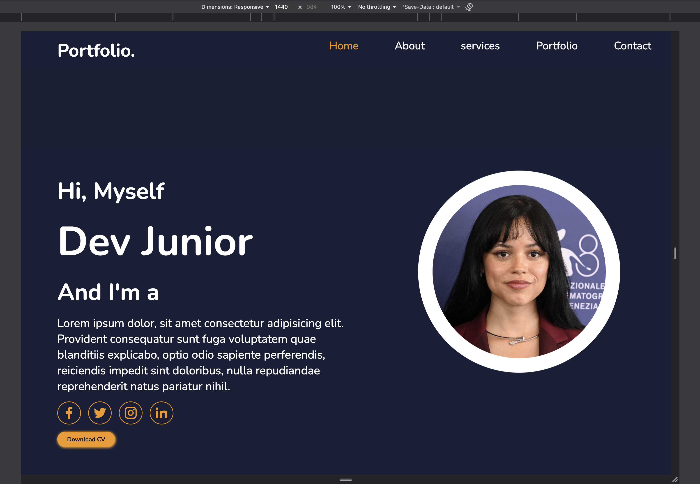
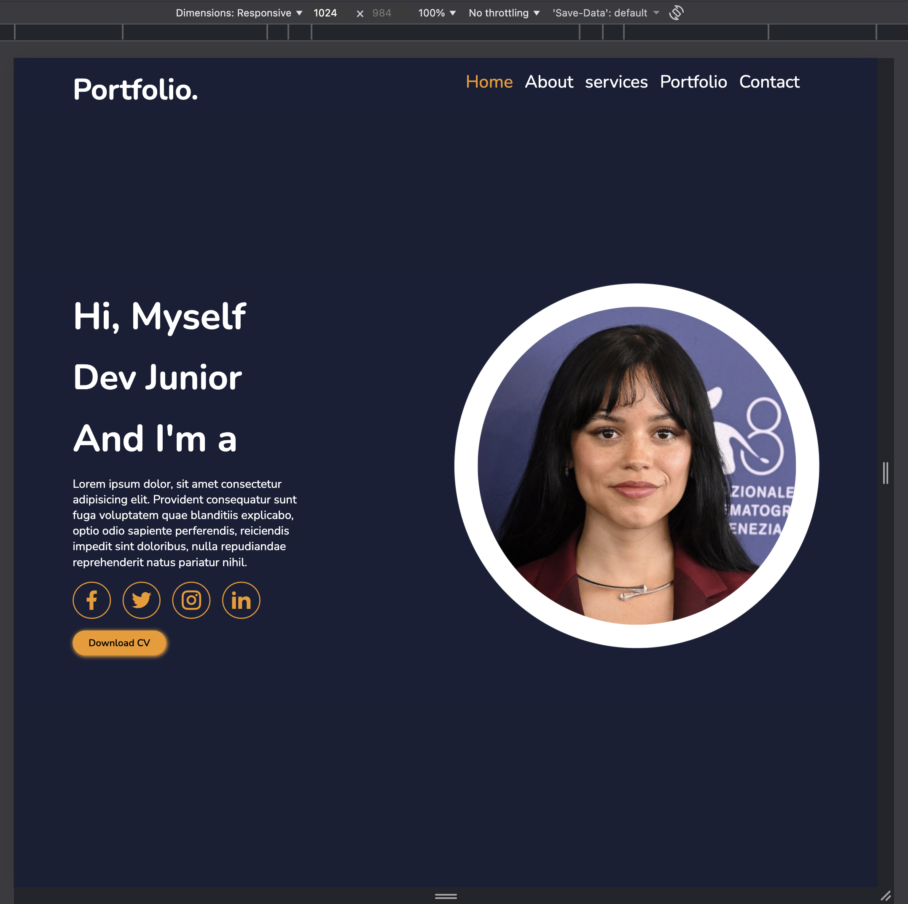
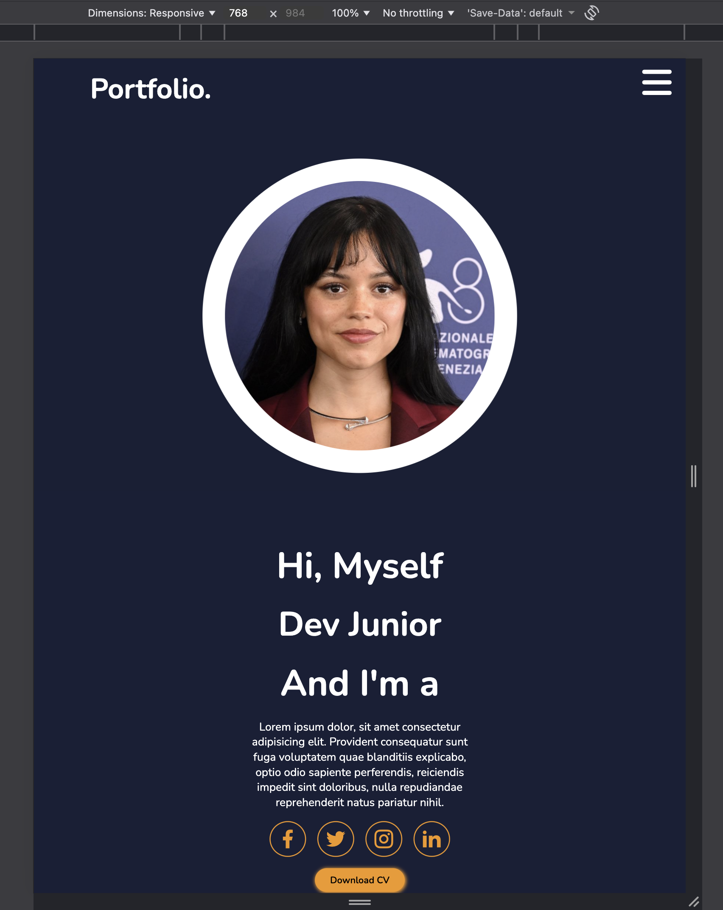
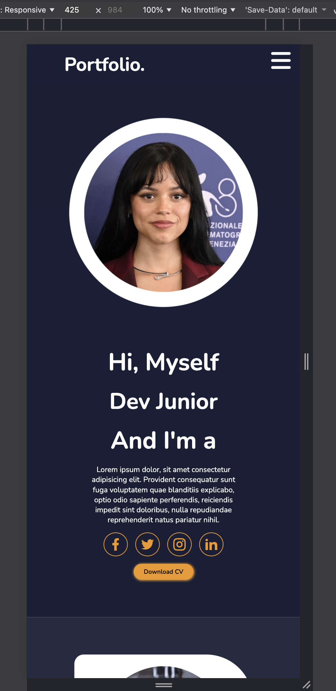
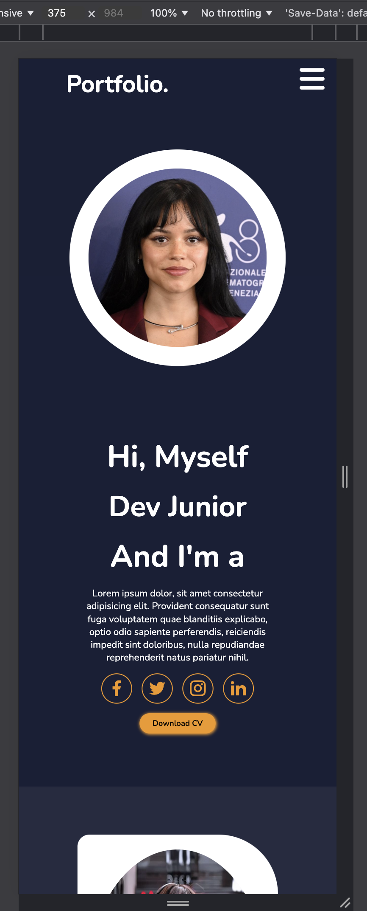
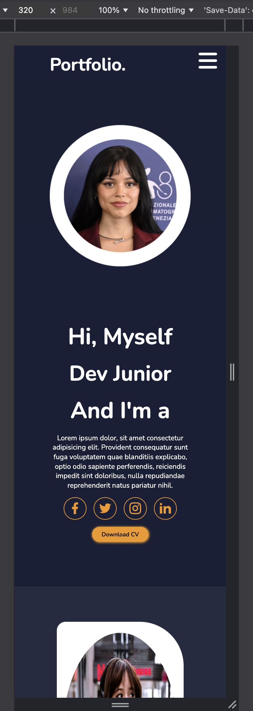

# Portfolio

## Objectif du Projet


## Spécifications


## Ma Structure

```
body
├── header
│   └── nav
│       ├── div.portfolio
│       │   └── h2
│       └── div.menu
│           ├── input#menu-toggle
│           ├── label
│           │   └── i.fa-solid.fa-bars
│           └── ul
│               ├── li > a[href="#home"]
│               ├── li > a[href="#about"]
│               ├── li > a[href="#services"]
│               ├── li > a[href="#portfolio"]
│               └── li > a[href="#contact"]
│
├── main
│   ├── section#home
│   │   ├── div.profil
│   │   │   ├── h3 ("Hi, Myself")
│   │   │   ├── h1 ("Dev Junior")
│   │   │   ├── h3 ("And I'm a")
│   │   │   ├── p (description)
│   │   │   ├── ul (icônes réseaux)
│   │   │   │   ├── li > i.ri-facebook-fill
│   │   │   │   ├── li > i.ri-twitter-fill
│   │   │   │   ├── li > i.ri-instagram-line
│   │   │   │   └── li > i.ri-linkedin-fill
│   │   │   └── button ("Download CV")
│   │   └── div.image
│   │       └── img[src="jenna2.png"]
│
│   ├── section#about
│   │   ├── div.maphoto
│   │   │   └── img[src="jenna1.png"]
│   │   └── div.apropos
│   │       ├── h1 ("About Me")
│   │       ├── h3 ("Frontend Developer")
│   │       ├── p (texte descriptif)
│   │       └── button ("Read More")
│
│   ├── section#services
│   │   ├── h1 ("My Services")
│   │   └── div.list
│   │       ├── div.categorie (Web Development)
│   │       ├── div.categorie (UI/UX Designing)
│   │       └── div.categorie (App Development)
│
│   ├── section#portfolio
│   │   ├── h1 ("Latest Project")
│   │   └── div.projets
│   │       ├── div.images (×6)
│   │       │   ├── img
│   │       │   └── div.images-overlay
│   │       │       ├── h3
│   │       │       ├── p
│   │       │       └── span > i.fa-solid.fa-arrow-up-right-from-square
│
│   └── section#contact
│       ├── h1 ("Contact Me!")
│       └── div.niveau
│           ├── div.maps
│           │   └── iframe (Google Maps)
│           └── div.contact
│               ├── input[type=text]
│               ├── input[type=email]
│               ├── input[type=number]
│               ├── input[type=email]
│               ├── textarea#message
│               └── button ("Send Message")
│
└── footer
    ├── p ("Copyright...")
    └── button
        └── a[href="#home"]
            └── i.ri-arrow-up-s-line
```


## Les Proptiétés CSS


1. Base globale

Police : Nunito importée de Google Fonts.

Reset : * { margin: 0; padding: 0; font-family: Nunito; } → supprime les marges/paddings par défaut et uniformise la police.

Sections : min-height: 100vh; → chaque section occupe toute la hauteur de l’écran.

2. Header (navigation fixe)

Fixé en haut avec position: fixed; et z-index: 9999.

Fond sombre #191f36 et texte blanc.

Disposition :

nav → display: flex; justify-content: space-between; padding: 1rem 5rem;

ul → display: flex; gap: 5rem;

Effet hover : liens deviennent orange #f49818.

Bouton menu (mobile) : icône cachée en grand écran, affichée en petit (display: none → display: block dans media queries).

Menu burger : #menu-toggle gère l’ouverture du menu mobile (affiche/masque la liste).

3. Section 1 – Accueil / Profil

Mise en page : flex horizontal avec gap: 10rem, fond #191f36.

Texte (profil) :

h1 (5.6rem), h3 (3.2rem).

Liste d’icônes (réseaux sociaux) circulaires bordées d’orange.

Bouton orange arrondi border-radius: 25px.

Image de profil :

Cercle blanc (border-radius: 50%) et animation floatImage (effet flottant haut/bas).

4. Section 2 – À propos

Fond : #262b40, texte blanc.

Structure : 2 colonnes — texte et photo.

Texte : h1 span coloré orange, paragraphes clairs.

Bouton : identique au style principal (orange arrondi).

Photo : cadre arrondi asymétrique (border-radius: 20px 100px 0 0).

5. Section 3 – Compétences / Catégories

Disposition : en colonne centrée, avec plusieurs .categorie côte à côte (display: flex; gap: 2rem;).

Chaque catégorie :

Fond #262b40, bord arrondi.

Icône géante (font-size: 7rem) orange.

Hover : effet zoom léger (transform: scale(1.02)) + bord orange.

Bouton orange assorti.

6. Section 4 – Projets

Grille de 3 colonnes (grid-template-columns: repeat(3, 1fr);).

Carte projet (.images) :

Image arrondie et effet hover avec overlay animé :

images-overlay monte du bas avec dégradé orange → transparent.

Texte ou icône apparaît avec opacity: 1 + translateY(0) à l’hover.

 7. Section 5 – Contact / Carte

Mise en page :

.maps → carte Google intégrée (iframe).

.contact → grille pour le formulaire (inputs, textarea, bouton).

.niveau → disposition du bouton centré.

Style :

Fond sombre (#191f36).

Champs (input, textarea) sur fond gris bleuté #262b40.

Bouton orange arrondi border-radius: 25px;.

8. Footer

Disposition : flex horizontal, espace entre contenu et bouton.

Fond sombre #262b40.

Bouton : orange sans ombre, icône noire (ex: flèche retour haut de page).

 9. Responsivité
➤ @media (max-width: 1024px)

Moins d’espace (gap réduit, polices plus petites).

Grille projets → 2 colonnes.

Images plus larges pour adapter le layout.

➤ @media (max-width: 768px)

Navigation transformée en menu burger.

Sections deviennent verticales et centrées.

Alignement centré pour le texte et les boutons.

Formulaire et carte passent en une seule colonne.

➤ @media (max-width: 425px)

Layout totalement vertical.

Police réduite (1rem), images élargies (80%).

Formulaire sur une seule colonne.

Footer centré et compact.


Animations

@keyframes floatImage → effet de flottement de l’image de profil (haut-bas continu).

Transitions douces au survol (0.5s).

## Captures

### Ecran 1440px



### Ecran 1024px



### Ecran 768px



### Ecran 425px



### Ecran 375px



### Ecran 320px




## GitHub Pages

https://oummy100.github.io/portfolio/